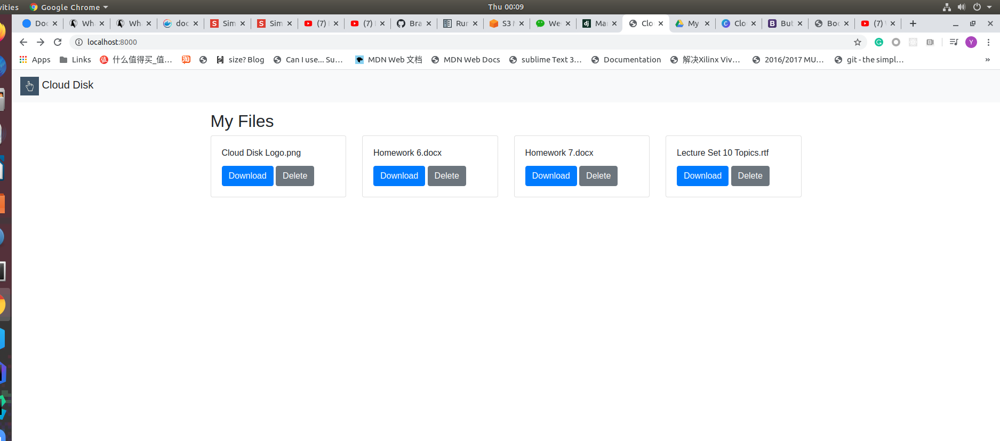

# Cloud-Disk-Server
Django application server for a distributed cloud disk storage



## How to run
```shell script
docker-compose up -d
```
bulid and run all 3 containers

```shell script
docker exec -it clouddisk_web_1 bash
```
get into the django web app container

```shell script
python3 manage.py collectstatic
python3 manage.py migrate
```
collect the static files to the shared volume (share to Nginx)
migrate the SQL DB
